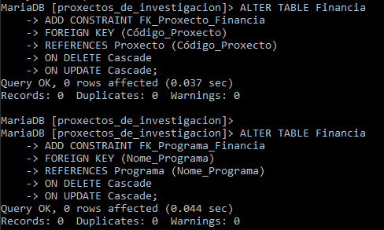

# Instalación de MariaDB en Windows


Introducimos la contraseña del root


Modificamos las variables de entorno del sistema y le añadimos la ruta de la carpeta bin del MariaDB


Instalación correcta y funcionamiento del MariaDB correcto


# Creación Proxectos_De_Investigación


Creamos la base de datos escribiendo el nombre que le vamos a dar y una vez creada la elegimos con ```use``` para trabajar en ella. Para ver todas las bases de datos creadas en una simulación de interfaz gráfica usamos ```show databases```.


Una vez creada la base de datos, crearemos las tablas en ella, introduciendo el nombre de las tablas y los atributos de la misma. Para comprobar que todo esta correcto usaremos el comando ```describe```seguido del nombre de la tabla que queremos comprobar.


Seguimos creando las tablas restantes. 
Podemos ver que tablas hemos creado con el comando ```show tables```.


Cuando hemos creado las tablas necesarias podemos hacer el ```ALTER TABLE``` para añadir los ```constraint``` que antes no podíamos


Seguimos creando tablas




Una vez creadas todas las tablas y añadidos todos los ```constraint``` que queríamos añadir, es decir cuando nuestra base de datos este completa, podemos comprobar todas las tablas usando el comando ```describe``` explicado anteriormente.


# Creación Naves_Espaciais


Creamos la base de datos escribiendo el nombre que le vamos a dar y una vez creada la elegimos con use para trabajar en ella.


Creamos todas las tablas de la base de datos


