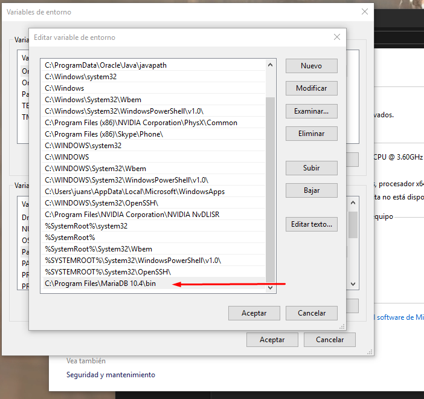

# Instalación de MariaDB en Windows

Introducimos la contraseña del root

Modificamos las variables de entorno del sistema y le añadimos la ruta de la carpeta bin del MariaDB

Instalación correcta y funcionamiento del MariaDB correcto